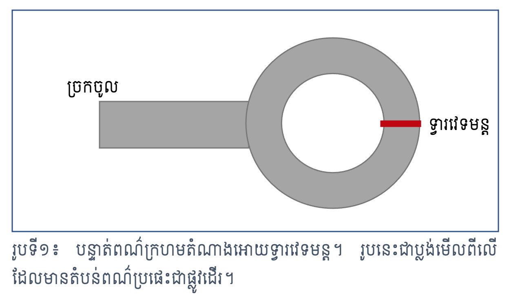
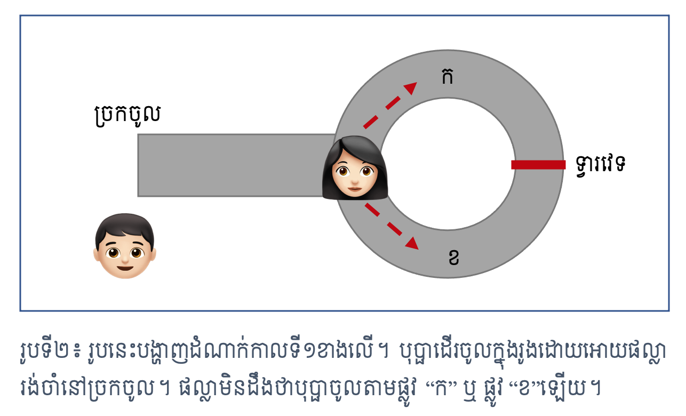
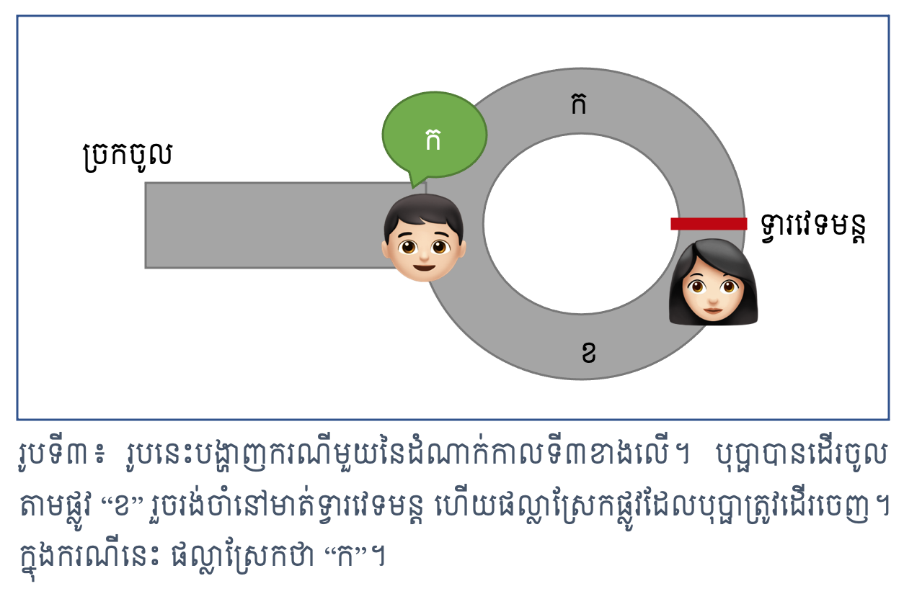
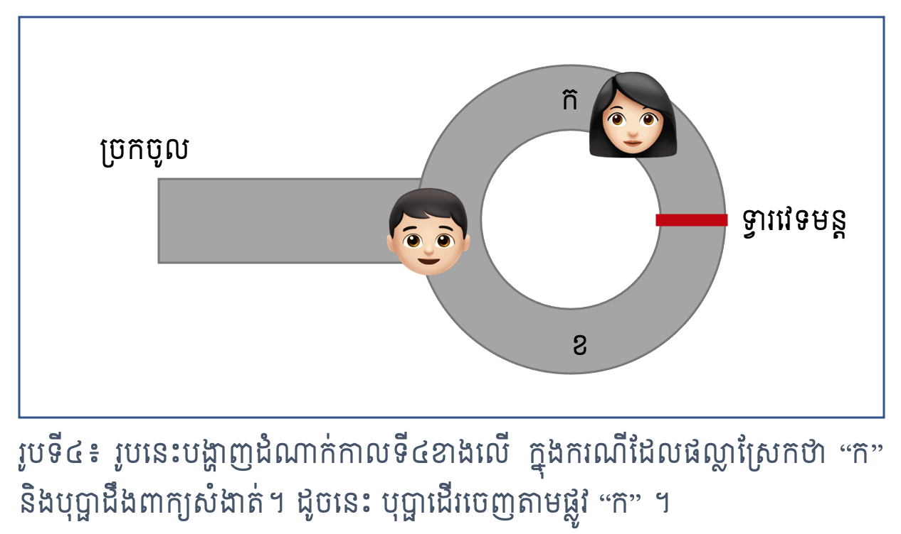

> អត្ថបទដោយ លោកបណ្ឌិត ឃុន គីមអាង

នេះគឺជាអត្ថបទដែលខ្ញុំបានចូលរួមចែករំលែកជាមួយនឹងព្រឹត្តិប័ត្រលេខ៤របស់សមាគមអាអុិចកា។ អ្នកអាចស្វែងរកព្រឹត្តិប័ត្រទាំងមូលតាមរយៈ<a href="http://bit.ly/axknewsletter_no4" target="_blank">តំណនេះ</a>។

# សេចក្តីផ្តើម

ស្រមៃថាអ្នកនិងមិត្តភក្តិម្នាក់ទើបតែប្រលងជាប់បាក់ឌុប។ អ្នកទាំង២ចង់ដឹងថាតើអ្នកទាំង២បាននិទ្ទេសដូចគ្នាឬទេ តែដោយគោរពលើឯកជនភាព អ្នកទាំង២មិនចង់ទម្លាយនិទ្ទេសរបស់ខ្លួនប្រាប់គ្នាទេ ហើយក៏មិនចង់អោយអ្នកណាផ្សេងដឹងថាអ្នកទាំង២បាននិទ្ទេសដូចគ្នាឬខុសគ្នាដែរ។ តើអ្នកទាំង២គួរធ្វើបែបណាដើម្បីឆ្លើយសំនួរខាងដើមដោយមិនល្មើសនឹងលក្ខខណ្ឌ?

នេះគឺជាឧទាហរណ៍មួយនៃការស្វែងរក “សម្រាយបញ្ជាក់ដោយមិនលេចចំណេះដឹង” (Zero-knowledge proof) ដែលនៅក្នុងឧទាហរណ៍ខាងលើ ចំណេះដឹងសំដៅលើ “កម្រិតនិទ្ទេស” ឯសម្រាយបញ្ជាក់សំដៅលើ “វិធីសាស្រ្តដែលធ្វើអោយអ្នកទាំង២យល់ស្របគ្នាថាពិតជាមាននិទ្ទេសដូចគ្នា ឬខុសគ្នា”។ យើងនឹងហៅកាត់ “សម្រាយបញ្ជាក់ដោយមិនលេចចំណេះដឹង” (Zero-knowledge proof) ថា “ហ្ស៊ីខេភី” (ZKP)។ ហ្ស៊ីខេភីត្រូវបានតាក់តែឡើងដំបូងនៅឆ្នាំ១៩៨៥ ដោយអ្នកស្រី Shafi Goldwasser លោក Silvio Micali និង លោក Charles Rackoff ហើយត្រូវបានបោះពុម្ភផ្សាយក្នុងអត្ថបទ “The knowledge complexity of interactive proof-systems” [[1]](#shafi2019)។

សម្រាប់កថាខណ្ឌខាងក្រោម ខ្ញុំនឹងសរសេរពន្យល់ថាអ្វីទៅជាហ្ស៊ីខេភី។ បន្ទាប់មក ខ្ញុំនឹងលើកឧទាហរណ៍ងាយ១ដើម្បីពន្យល់មូលដ្ឋានគ្រឹះនៃហ្ស៊ីខេភី។ នៅចុងបញ្ចប់នៃអត្ថបទ យើងនឹងនិយាយអំពីសារៈប្រយោជន៍នៃហ្ស៊ីខេភីក្នុងជីវិតប្រចាំថ្ងៃ ហើយវិលត្រលប់មកឆ្លើយសំនួរខាងលើវិញ។

# ហ្ស៊ីខេភីជាអ្វី?

សម្រាយបញ្ជាក់ដោយមិនលេចចំណេះដឹង ឬហ្ស៊ីខេភី គឺជាវិធីសាស្រ្ត ឬប្រមាណវិធីដែលបង្ហាញថាសំណើ (Statement) មួយពិត ដោយមិនលេចចេញព័ត៌មានអ្វីបន្ថែមក្រៅតែពីភាពពិតនៃសំណើមួយនោះឡើយ។ ហ្ស៊ីខេភីប្រព្រឹត្តទៅដោយការឆ្លើយឆ្លងគ្នា (interactioninteraction) រវាងភាគី២គត់៖
1. ភាគីអ្នកបង្ហាញ (Prover) ដែលចង់បង្ហាញថាសំណើពិត និង
2. ភាគីអ្នកផ្ទៀងផ្ទាត់ (Verifier) ដែលផ្ទៀងផ្ទាត់ភាពពិតនៃសំណើ។
ហ្ស៊ីខេភីមានសារៈសំខាន់ក៏ព្រោះថា អ្នកបង្ហាញអាចស្រាយបំភ្លឺយ៉ាងងាយស្រួលបំផុតថាខ្លួនដឹងពីអាថ៌កំបាំង១ ដោយគាត់គ្រាន់តែទម្លាយអាថ៌កំបាំងនោះទៅកាន់អ្នកផ្ទៀងផ្ទាត់។ អ្វីដែលធ្វើអោយហ្ស៊ីខេភីមានភាពសាំញ៉ាំគឺការស្រាយថាខ្លួនពិតជាដឹងពីអាថ៌កំបាំងតែមិនទម្លាយអាថ៌កំបាំង ឬបង្ហើបព័ត៌មានអ្វីបន្ថែមទាក់ទងនឹងអាថ៌កំបាំងនោះឡើយ។

តាមនិយមន័យក្នុងអត្ថបទ “Zero-knowledge proofs identity” [[2]](#uriel1987) សម្រាយបញ្ជាក់នៃសំណើ១ជាហ្ស៊ីខេភី បើការអនុវត្តសម្រាយបញ្ជាក់នេះផ្ទៀងផ្ទាត់លក្ខណៈ៣យ៉ាង៖

- ពេញលេញ (Completeness)៖ បើសំណើនោះពិត អ្នកបង្ហាញដែលស្មោះត្រង់(មិនប្រើល្បិចកល) នឹងធ្វើអោយអ្នកផ្ទៀងផ្ទាត់ដែលស្មោះត្រង់(មិននិយាយកុហកខុសការពិត) ទទួលស្គាល់ថាសំណើនោះពិតមែន
- ត្រឹមត្រូវ (Soundness)៖ បើសំណើនោះមិនពិត គ្មានអ្នកបង្ហាញណាអាចប្រើប្រាស់ល្បិចកលធ្វើអោយអ្នកផ្ទៀងផ្ទាត់ស្មោះត្រង់ណាទទួលស្គាល់ថាសំណើនោះពិតឡើយ(ឬគាត់ទទួលស្គាល់ថាពិតដោយប្រូបាប៊ីលីតេតូចបំផុតអាចចោលបាន)
- មិនលេចចំណេះដឹង (Zero-knowledge)៖ បើសំណើនោះពិត គ្មានអ្នកផ្ទៀងផ្ទាត់ណាទទួលបានចំណេះដឹងបន្ថែមអ្វីក្រៅតែពីសំណើនោះពិតឡើយ។ លក្ខណៈនេះមានន័យថាចំណេះដឹងរបស់អ្នកផ្ទៀងផ្ទាត់មុន និងក្រោយពេលឆ្លើយឆ្លងជាមួយអ្នកបង្ហាញមិនខុសគ្នាឡើយ។ និយាយម៉្យាងទៀត បន្ទាប់ពីបានអនុវត្តសម្រាយបញ្ជាក់និងបានទទួលស្គាល់ថាសំណើនោះពិត អ្នកផ្ទៀងផ្ទាត់មិនអាចប្រើប្រាស់សម្រាយបញ្ជាក់ដែលគាត់បានឆ្លើយឆ្លងជាមួយអ្នកបង្ហាញទៅបំភ្លឺភាគីដទៃផ្សេងទៀតអោយទទួលស្គាល់ថាសំណើនោះពិតបានឡើយ (ក្នុងន័យនេះ មានតែអ្នកបង្ហាញប៉ុណ្ណោះដែលអាចបំភ្លឺថាខ្លួនដឹងអាថ៌កំបាំង។ បើគ្មានអ្នកបង្ហាញ អ្នកផ្ទៀងផ្ទាត់ដែលបានទទួលស្គាល់ថាអ្នកបង្ហាញដឹងអាថ៌កំបាំង គ្មានវិធីសាស្រ្តអ្វីធ្វើអោយអ្នកដទៃទទួលស្គាល់ថាអ្នកបង្ហាញដឹងអាថ៌កំបាំងឡើយ)។

ដើម្បីអោយលក្ខណៈទាំង៣កាន់តែច្បាស់លាស់ សូមពិនិត្យមើលឧទាហរណ៍តទៅនេះ។ លោក Jean-Jacques Quisquater និងក្រុមការងារគាត់បានផ្តល់ឧទាហរណ៍ងាយមួយដែលបង្ហាញអំពីមូលដ្ឋានគ្រឹះនៃសម្រាយបញ្ជាក់ដោយមិនលេចចំណេះដឹងក្នុងអត្ថបទ “How to explain zero-knowledge protocols to your children” [[3]](#jean2001)។ យើងសន្មត់ថាអ្នកបង្ហាញឈ្មោះថាបុប្ផា ឯអ្នកផ្ទៀងផ្ទាត់ឈ្មោះផល្លា។ នៅក្នុងឧទាហរណ៍របស់លោក Jean-Jacques និងក្រុមការងារគាត់ បុប្ផាដឹងអំពីពាក្យសំងាត់ដើម្បីបើកទ្វារវេទមន្តនៅក្នុងរូងមួយដែលមានផ្លូវដើរជារង្វង់ដូចក្នុងរូបទី១ខាងក្រោម។ បុប្ផាចង់បង្ហាញអោយផល្លាតែម្នាក់គត់ជឿថាខ្លួនដឹងពាក្យសំងាត់ តែមិនចង់ប្រាប់ពាក្យសំងាត់ទៅអោយផល្លាឡើយ (សំណើដែលត្រូវបង្ហាញគឺ “បុប្ផាដឹងពាក្យសំងាត់”)។ ឯផល្លាចង់ផ្ទៀងផ្ទាត់ថាបុប្ផាដឹងពាក្យសំងាត់មែនឬទេ តែផល្លាខ្លួនឯងមិនចង់ដឹងពាក្យសំងាត់នោះជាអ្វីឡើយ។ តើគេទាំង២គួរមានវិធីសាស្រ្តបែបណា ដើម្បីដោះស្រាយចំណោទនេះ? មិត្តអ្នកអានដែលមិនធ្លាប់ដឹងអាចសាកគិតមើលសិនមុននឹងបន្តអាន។

អ្នកទាំង២ហៅផ្លូវខាងឆ្វេងថា “ក” និងផ្លូវខាងស្តាំថា “ខ” ដូចក្នុងរូបខាងក្រោម ហើយប្រើប្រាស់វិធីសាស្រ្តមាន៤ដំណាក់កាលដូចតទៅ៖
1. បុប្ផាដើរចូលក្នុងរូងមុន ដោយអោយផល្លានៅរង់ចាំខាងក្រៅដូចក្នុងរូបទី២។
2. ពេលដើរដល់ទ្វារវេទមន្ត បុប្ផាស្រែកហៅផល្លាអោយដើរចូលត្រឹមផ្លូវបំបែក។
3. ពេលដើរដល់ផ្លូវបំបែក ផល្លាមានជម្រើស២ គឺស្រែកថា “ក” ឬស្រែកថា “ខ”។ រូបទី៣បង្ហាញករណីដែលផល្លាស្រែកថា "ក"។
4. បុប្ផាដើរចេញតាមផ្លូវ “ក” បើផល្លាស្រែកថា “ក” ឬចេញតាមផ្លូវ “ខ” បើផល្លាស្រែកថា “ខ”។ រូបទី៤បង្ហាញករណីដែលផល្លាស្រែកថា "ក" ហើយបុប្ផាចេញតាមផ្លូវ "ក"។

ប្រសិនបើបុប្ផាដឹងពាក្យសំងាត់មែន បុប្ផានឹងចេញតាមផ្លូវដែលផល្លាស្រែកដោយមិនអាក់ខាន។ ដូចនេះវិធីសាស្រ្តនេះមានលក្ខណៈពេញលេញ (Completeness)។ បើបុប្ផាមិនដឹងពាក្យសំងាត់ទេ បុប្ផាអាចត្រឹមតែទាយជម្រើសរបស់ផល្លានៅពេលដែលខ្លួនដើរចូលក្នុងរូង (ដំណាក់កាលទី១ខាងលើ) ហើយឳកាសដែលបុប្ផាទាយត្រូវមានតែ៥០ភាគរយប៉ុណ្ណោះ។ ដូចនេះ ប្រសិនបើអ្នកទាំង២ធ្វើវិធីសាស្រ្តនេះសារឡើងវិញ១ដង ឳកាសដែលបុប្ផាតែងតែចេញតាមផ្លូវដែលផល្លាស្រែកមាន៥០ភាគរយ បើធ្វើ២ដង ឳកាសនោះមាន២៥ភាគរយ បើ $n$ ដងមាន $100/2^n$  ភាគរយ។ បើបុប្ផាមិនដឹងពាក្យសំងាត់ទេ បុប្ផាអាចធ្វើអោយផល្លាទទួលស្គាល់ថាខ្លួនដឹងពាក្យសំងាត់ដោយឳកាសតូចបំផុតអាចចោលបាន។ ដូចនេះ វិធីសាស្រ្តនេះមានលក្ខណៈត្រឹមត្រូវ (Soundness)។
សរុបមក បើបុប្ផាតែងតែចេញតាមផ្លូវដែលផល្លាស្រែក ផល្លាអាចសន្និដ្ឋានបានថាបុប្ផាពិតជាដឹងពាក្យសំងាត់មែន។

តើវិធីសាស្រ្តដែលមាន៤ដំណាក់កាលខាងលើនេះគឺជាសម្រាយបញ្ជាក់ដោយមិនលេចចំណេះដឹងដែរឬទេ? ដើម្បីឆ្លើយនឹងសំនួរនេះ ឧបមាថាផល្លាបំពាក់កាមេរ៉ាសម្ងាត់លើអាវដើម្បីថតសកម្មភាពនៃវិធីសាស្រ្តខាងលើ ហើយផល្លានិងបុប្ផាអនុវត្តវិធីសាស្រ្តខាងលើសារឡើងវិញ២០ដង។ ផល្លាបង្ហាញវីដេអូដែលបានថតអោយមិត្តអ្នកអានមើល ដែលក្នុងនោះមិត្តអ្នកអានឃើញថាបុប្ផាតែងតែចេញតាមផ្លូវដែលផល្លាស្រែក។ តើមិត្តអ្នកអានអាចសន្និដ្ឋានថា បុប្ផាដឹងពាក្យសំងាត់ដែរឬទេ? សូមអ្នកសាកគិតនិងឆ្លើយសំនួរនេះសិនមុននឹងបន្តអាន។

ដោយគ្រាន់តែមើលវីដេអូរបស់ផល្លា យើងមិនអាចសន្និដ្ឋានថាបុប្ផាដឹងពាក្យសំងាត់បានទេព្រោះថាបុប្ផានិងផល្លាអាចត្រូវរ៉ូវគ្នាមុននឹងថតវីដេអូ ដោយផល្លាអោយបុប្ផាដឹងមុនពីលំដាប់លំដោយនៃផ្លូវដែលខ្លួននឹងស្រែក។ ចំណែកឯបុប្ផាគ្រាន់តែដើរចូលតាមផ្លូវដែលមានលំដាប់លំដោយដូចផល្លាបានប្រាប់ រួចចេញមកវិញដោយមិនចាំបាច់ដឹងពាក្យសំងាត់ឡើយ។ ដូចនេះ បើមិនមានការឆ្លើយឆ្លងជាមួយបុប្ផា គ្មានអ្នកផ្ទៀងផ្ទាត់ផ្សេងណាអាចដឹងថាបុប្ផាដឹងពាក្យសម្ងាត់ឡើយ លើកលែងតែពីផល្លា ចំណែកឯផល្លាក៏មិនបានដឹងថាពាក្យសំងាត់ជាអ្វីដែរ ហើយគ្មានវិធីធ្វើអោយអ្នកដទៃទទួលស្គាល់ថាបុប្ផាដឹងពាក្យសំងាត់បានទេ។ នេះបញ្ជាក់ថាវិធីសាស្រ្តខាងលើមានលក្ខណៈមិនលេចចំណេះដឹង (Zero-knowledge)។ យើងអាចសន្និដ្ឋានបានថា វិធីសាស្រ្តមាន៤ដំណាក់កាលខាងលើជាហ្ស៊ីខេភី។

សព្វថ្ងៃនេះហ្ស៊ីខេភីត្រូវបានគេយកទៅអនុវត្តយ៉ាងទូលំទូលាយក្នុងការការពារឯកជនភាព និងការរក្សាការសំងាត់ដូចជា ប្លក់ឆេន(blockchain) ប្រព័ន្ធសុវត្ថិភាពសាយប៊ឺ (cyber security) និងវែបបី (Web3) ជាដើម។ ហ្ស៊ីខេភីក៏មានការរីកចម្រើនខាងផ្នែកទ្រឹស្តីផងដែរ។ តួយ៉ាង ហ្ស៊ីខេភីត្រូវបានបែងចែកយ៉ាងតិចណាស់ជា២ប្រភេទធំៗគឺ
1. Zero-knowledge Succinct Non-Interactive Argument of Knowledge
2. Zero-knowledge Scalable Transparent Argument of Knowledge.

# សេចក្តីសន្និដ្ឋាន

ក្នុងអត្ថបទនេះ យើងបានស្គាល់ថាហ្ស៊ីខេភីជាសម្រាយបញ្ជាក់ដែលផ្ទៀងផ្ទាត់លក្ខខណ្ឌ៣យ៉ាងគឺ ១) ពេញលេញ ២) ត្រឹមត្រូវ និង ៣) មិនលេចចំណេះដឹង។ ជាចុងក្រោយ ដើម្បីដឹងថាអ្នកនិងមិត្តភក្តិអ្នកមាននិទ្ទេសដូចគ្នាឬទេ អ្នកនិងគាត់អាចអនុវត្តវិធីសាស្រ្តដូចតទៅ។ អ្នកទិញហឹបចាក់សោរដូចគ្នាបេះបិទចំនួន៦ (ព្រោះនិទ្ទេសមាន៦ អេ ប៊ី ស៊ី ឌី អ៊ី ហ្វេស)។ អ្នកទាំង២ហែកក្រដាសតូចៗចំនួន៧សន្លឹក ដោយ៦សន្លឹកសរសេរនិទ្ទេសអេដល់ហ្វេស ហើយបិទលើហឹប ១ហឹប ១និទ្ទេស។ ១សន្លឹកចុងក្រោយសរសេរសញ្ញា “=”។ អ្នកយកហឹបទាំង៦ និងក្រដាស១សន្លឹកនោះចូលក្នុងបន្ទប់សំងាត់ ហើយអោយមិត្តភក្តិចាំនៅក្រៅបន្ទប់។ អ្នកដាក់សញ្ញា “=” ចូលក្នុងហឹបដែលបិទនិទ្ទេសរបស់អ្នក។ បន្ទាប់មក អ្នកចាក់សោរហឹបទាំងអស់រួចចេញក្រៅដោយទុកកូនសោរទាំង៦ក្នុងដៃអ្នក។ មិត្តភក្តិអ្នកចូលក្នុងបន្ទប់ ហើយយកហឹប៥ដែលខុសនិទ្ទេសគាត់ដាក់មួយឡែក រួចបកផ្លាកនិទ្ទេសចេញពីហឹបទាំង៦។ បន្ទាប់មក មិត្តភក្តិអ្នកយកហឹបទាំង៥ដែលនៅមួយឡែកនោះចេញក្រៅរួចចូលក្នុងបន្ទប់វិញជាមួយអ្នក។ អ្នកទាំង២ចូលក្នុងបន្ទប់រួចបើកហឹបតែ១គត់ដែលសល់ក្នុងបន្ទប់នោះ។ បើអ្នកទាំង២ឃើញសញ្ញា “=” ក្នុងហឹប នោះអ្នកទាំង២មាននិទ្ទេសដូចគ្នា។ បើហឹបនោះទទេ នោះអ្នកទាំង២មាននិទ្ទេសខុសគ្នា។ យើងសន្មត់ថាមិត្តភក្តិអ្នកមិនចំណាំទុកកូនសោរណាត្រូវជាមួយហឹបណាឡើយ។ តើអ្នកយល់ថាវិធីសាស្រ្តនេះជាហ្ស៊ីខេភីដែរឬទេ?

# ឯកសារយោង
<a name="shafi2019">[1]</a> Shafi Goldwasser, Silvio Micali, Charles Rackoff, "The knowledge complexity of interactive proof-systems," in Providing Sound Foundations for Cryptography: On the Work of Shafi Goldwasser and Silvio Micali, 2019, pp. 203-225.

<a name="uriel1987">[2]</a> Uriel Feige, Amos Fiat, Adi Shamir, "Zero-knowledge proofs of identity," in Proceedings of the nineteenth annual ACM symposium on Theory of computing, 1987, pp. 210-217.

<a name="jean2001">[3]</a> Jean-Jacques Quisquater, Myriam Quisquater, Muriel Quisquater, Michael Quisquater, Louis Guillou, Marie Annick Guillou, Gaid Guillou, Anna Guillou, Gwenolé Guillou, Soazig Guillou, "How to explain zero-knowledge protocols to your children," in Advances in Cryptology—CRYPTO’89 Proceedings, Springer, 2001, pp. 628-631.

