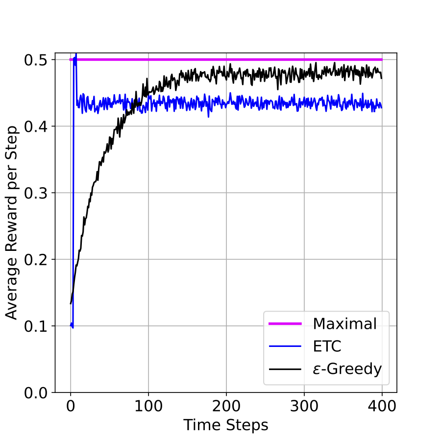
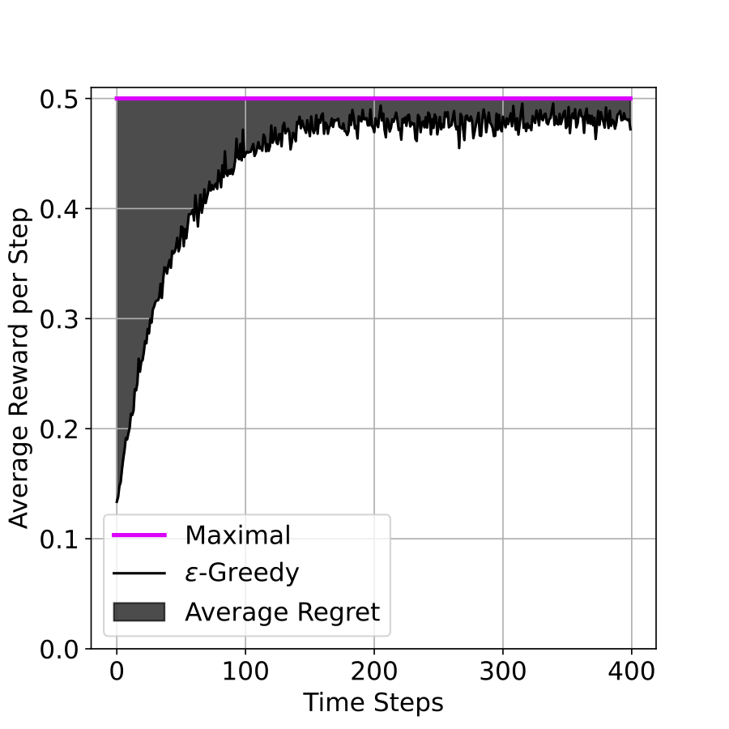
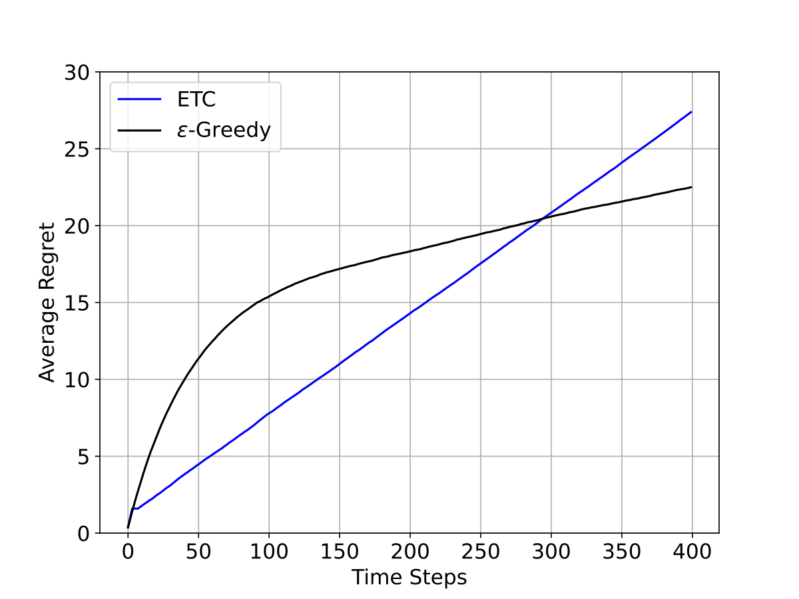
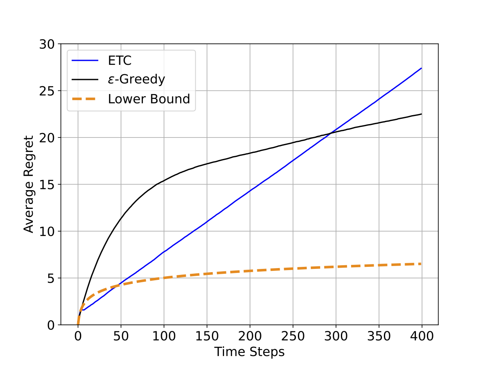

&emsp; &emsp; Multi-armed bandit (MAB) គឺជាបញ្ហាគណិតវិទ្យាមួយដែលត្រូវបានសិក្សាយ៉ាងស៊ីជម្រៅ និងប្រើប្រាស់យ៉ាងទូលំទូលាយ។ MAB ត្រូវបានផ្តួចផ្តើមដំបូងក្នុងសហគមន៍អ្នកស្រាវជ្រាវតាំងពីឆ្នាំ១៩៣៣មកម៉្លេះ [[1]](#thompson1933likelihood) ហើយនៅតែបន្តត្រូវបានគេសិក្សារហូតមកដល់សព្វថ្ងៃ [[2]](#simchi2023multi)។ MAB គឺជាគម្រូលេខនៃបញ្ហារស់នៅក្នុងជីវិតយ៉ាងច្រើនដូចជា ការសាកឃ្លីនិក (Clinical Trial [[1]](#thompson1933likelihood)) ប្រព័ន្ធផ្តល់យោបល់ (Recommendation system [[3]](#lattimore2020bandit)) និងការដាក់ផ្សព្វផ្សាយពាណិជ្ជកម្ម (Advert Placement [[3]](#lattimore2020bandit)) ជាដើម។ នេះបញ្ជាក់ថា MAB គឺជាបញ្ហាមួយដ៏សំខាន់ដែលយើងទាំងអស់គ្នាគួរតែយកចិត្តទុកដាក់ស្វែងយល់។

&emsp; &emsp; ក្នុងអត្ថបទនេះ ខ្ញុំនិងបរិយាយព័ត៌មានទាក់ទងនឹង MAB ដោយចាប់ផ្តើមពីការពន្យល់ពីនិយមន័យ និងប្រវត្តិសង្ខេបនៃ MAB ក្នុងផ្នែកទី១។ ផ្នែកទី២បកស្រាយអំពីទ្វេគ្រោះនៃការរុករកនិងការចំរាញ់ (Exploration-Exploitation Dilemma)។ ផ្នែកទី៣នឹងក្តោបលើរង្វាស់រង្វាល់គុណភាពនៃប្រមាណវិធី (Algorithm) ដែលដោះស្រាយបញ្ហា MAB ។ ខ្ញុំនឹងសង្ខេបអត្ថបទឡើងវិញក្នុងផ្នែកទី៤។

<!--end_excerpt-->

# Multi-armed bandit ជាអ្វី?

&emsp; &emsp; សូមពិចារណាបញ្ហាដូចតទៅនេះ។ ស្រមៃថាអ្នកត្រូវការសម្រេចចិត្តម្តងហើយម្តងទៀត ដោយជ្រើសរើស $1$ ក្នុងជម្រើស $k$។ ក្រោយការសម្រេចចិត្តម្តងៗ អ្នកអាចទទួលបានរង្វាន់ដែលមានលក្ខណៈចៃដន្យ ហើយភាពចៃដន្យនេះអាស្រ័យលើជម្រើសរបស់អ្នក។ អ្នកមានគោលបំណងបង្កើនមធ្យមនៃរង្វាន់សរុបទទួលបានអោយដល់អតិបរមា ដោយកំហិតថាចំនួនសម្រេចចិត្តមានកំណត់ ឧទាហរណ៍អ្នកអាចសម្រេចចិត្តបានតែមួយពាន់ដង ឬមួយពាន់ជំហានជាដើម។

&emsp; &emsp; នេះជាទម្រង់ដើមនៃបញ្ហា $k$-armed bandit ដែលឈ្មោះនេះយកតាមម៉ាស៊ីនល្បែងក្នុងកាស៊ីណូដូចក្នុង[រូបទី១](#slotMachine) ប៉ុន្តែប្តូរពីជួរមាន $k$ ម៉ាស៊ីនដៃ $1$ មកជាម៉ាស៊ីនមួយមានដៃ $k$ វិញ។ ការសម្រេចចិត្តម្តងៗគឺដូចជាការដាក់កាក់ទាញដៃណាមួយនៃម៉ាស៊ីននេះ ហើយការផ្តល់រង្វាន់ប្រៀបដូចជាម៉ាស៊ីននេះទម្លាក់លុយ (hit the jackpot) អុីចឹង។ តាមរយៈការលេងម្តងហើយម្តងទៀត អ្នកនឹងចំណាយកាក់ទាញតែដៃណាមួយគត់ដែលតែងតែទម្លាក់លុយច្រើននិងញឹកញាប់ជាងគេ។

<figure>
  

  <figcaption> រូបទី១៖ ជួរម៉ាស៊ីនដាក់កាក់ទម្លាក់លុយនៅរដ្ឋឡាសវេហ្គាស សហរដ្ឋអាមេរិច (<a href="https://en.wikipedia.org/wiki/Multi-armed_bandit">តំណ</a>) </figcaption>
</figure>

&emsp; &emsp; ដើម្បីសម្រួលដល់ការស្វែងយល់ ខ្ញុំនឹងប្រើប្រាស់ម៉ូដែលគណិតវិទ្យាសម្រាប់ $k$-armed bandit ដូចតទៅ។ សន្មត់ថាម៉ាស៊ីនអាចទម្លាក់រង្វាន់ $1$ ឯកតា ឬ $0$ ឯកតា ដែលឱកាសទម្លាក់រង្វាន់ $1$ ប្រែប្រួលតាមដៃនិមួយៗ និងសន្មត់ថាយើងអាចលេងបានតែ $T\in\mathbb{N}\setminus\\{0\\}$ ជំហានប៉ុណ្ណោះ ។ យើងតាង $\mu_i$ ជាឱកាស ឬតម្លៃសង្ឃឹម (ត្រង់នេះ ឱកាស និងតម្លៃសង្ឃឹមស្មើគ្នាក៏ព្រោះតែអថេរចៃដន្យមានរបាយ Bernoulli ហើយគេប្រើប្រាស់ តម្លៃសង្ឃឹម ក្នុងការអនុវត្តផ្លូវការ ប៉ុន្តែខ្ញុំប្រើប្រាស់ ឱកាស ដើម្បីជួយសម្រួលដល់ការពន្យល់របស់ខ្ញុំប៉ុណ្ណោះ)
ដែលដៃ $i$ ធ្វើអោយម៉ាស៊ីនទម្លាក់រង្វាន់ $1$ ហើយតាង $r_t\in\\{0,1\\}$ ជារង្វាន់ដែលទទួលបាននៅជំហាន $t$ ដែល $1\le t\le T$។ រង្វាន់សរុបបន្ទាប់ពីលេងបាន $T$ ជំហានគឺ $\sum_{t=1}^T r_t$។ ដោយសន្មត់ថាពេលចាប់ផ្តើមលេង យើងមិនស្គាល់អំពីតម្លៃ $\\{\mu_i\\}_{1\le i\le k}$ឡើយ យើងមានគោលបំណងប្រមូលជាអតិបរមា មធ្យមនៃរង្វាន់សរុបទទួលបានបន្ទាប់ពីលេងបាន $T$ ជំហាន 

$$\begin{equation}
\mathbb{E}\left[ \sum_{t=1}^T r_t\right]
\end{equation}$$

។ នេះជាម៉ូដែលគណិតវិទ្យាងាយមួយសម្រាប់បញ្ហា $k$-armed bandit។

&emsp; &emsp; ដោយសារម៉ូដែលគណិតវិទ្យាសម្រាប់បញ្ហា $k$-armed bandit មានលក្ខណៈសាមញ្ញ បញ្ហានេះត្រូវបានគេសិក្សា និងអនុវត្តយ៉ាងទូលំទូលាយ។ ការអនុវត្តក្លាសិកមួយគឺការសាកឃ្លីនិក (Clinical Trial [[1]](#thompson1933likelihood)) ដែលគ្រូពេទ្យត្រូវសម្រេចចិត្តអោយថ្នាំ $1$ ប្រភេទក្នុងចំណោមថ្នាំ $k$ ប្រភេទទៅអ្នកជម្ងឺដើម្បីអោយគាត់បានជាសះស្បើយ។ ដោយប្រើថ្នាំប្រភេទ $i$ អ្នកជម្ងឺមានឱកាសជាសះស្បើយ $100\times\mu_i$ ភាគរយ។ គ្រូពេទ្យមានគោលបំណងអោយចំនួនអ្នកជម្ងឺជាសះស្បើយមានច្រើនអតិបរមា ប៉ុន្តែលោកចាប់ផ្តើមព្យាបាលដោយមិនស្គាល់តម្លៃឱកាស $\mu_i$ ណាមួយឡើយ។ ការអនុវត្តមួយទៀតក្នុងសម័យឌីជីថល គឺការដាក់ផ្សព្វផ្សាយពាណិជ្ជកម្ម (Advert Placement [[3]](#lattimore2020bandit)) ដែលម្ចាស់វេបសាយចង់លក់ផលិតផលមួយ ដោយដាក់វីដេអូ $1$ ក្នុងចំណោមវីដេអូផ្សាយពាណិជ្ជកម្ម $k$ អោយអ្នកប្រើប្រាស់ (User) មើល។ ក្រោយមើលវីដេអូ $i$ អ្នកប្រើប្រាស់ចុចទិញដោយឱកាស $100\times\mu_i$ ភាគរយ។ ចាប់ផ្តើមដោយមិនស្គាល់ពីតម្លៃនៃ $\mu_i$ ណាមួយឡើយ ម្ចាស់វេបសាយមានគោលបំណងបង្កើនការលក់អោយបានអតិបរមា។ ទាំងនេះបញ្ជាក់ថា បញ្ហា $k$-armed bandit មានការអនុវត្តយ៉ាងច្រើន។

# ប្រមាណវិធី (Algorithm)

&emsp; &emsp; ដោយមិនស្គាល់ពីតម្លៃសង្ឃឹម $\\{\mu_i \\}_{1\le i\le k}$ យើងប្រឈមនឹងវិវាទការណ៍រវាងយុទ្ធសាស្រ្ត២គឺ ការរុករក (Exploration) និងការចំរាញ់ (Exploitation)។ ការរុករកអនុញ្ញាតអោយយើងប្រមូលព័ត៌មានដើម្បីប៉ាន់ប្រមាណតម្លៃសង្ឃឹមនៃដៃនិមួយៗអោយបានជាក់លាក់ ប៉ុន្តែបណ្តាលអោយយើងខាតជំហានព្រោះតែចំនួនជំហានសរុបមានកំណត់។ ចំណែកឯការចំរាញ់អនុញ្ញាតអោយយើងប្រើប្រាស់ព័ត៌មានប្រមូលបានដើម្បីប្រមាណថាដៃមួយណាមានតម្លៃសង្ឃឹមខ្ពស់ជាងគេ ប៉ុន្តែបណ្តាលអោយយើងសម្រេចចិត្តខុសនៅពេលដែលព័ត៌មានប្រមូលបានមិនទាន់គ្រប់គ្រាន់។ ជាឧទាហរណ៍ គ្រូពេទ្យអាចសាកថ្នាំនិមួយៗច្រើនដងដើម្បីដឹងពីប្រសិទ្ធភាពរបស់វា  ប៉ុន្តែអាចបណ្តាលអោយមានចំនួនអ្នកជម្ងឺជាសះស្បើយតិច ដែលធ្វើអោយគ្រូពេទ្យនោះបាត់បង់កេរ្តិឈ្មោះ។ ម៉្យាងទៀត គ្រូពេទ្យអាចប្រើប្រាស់បទពិសោធន៍របស់គាត់ដើម្បីសម្រេចថាថ្នាំមួយប្រភេទណាមានប្រសិទ្ធភាពខ្ពស់ជាងគេ ប៉ុន្តែបើបទពិសោធន៍មិនគ្រប់គ្រាន់ នោះការសម្រេចចិត្តគាត់នឹងមិនត្រឹមត្រូវដែលបណ្តាលអោយមានចំនួនអ្នកជម្ងឺជាសះស្បើយតិចដូចគ្នា។ ជាទូទៅ វិវាទការណ៍នេះត្រូវបានគេអោយឈ្មោះថា ទ្វេគ្រោះនៃការរុករកនិងការចំរាញ់ (Exploration-Exploitation Dilemma)។

&emsp; &emsp; ជាធម្មតា ប្រមាណវិធីដែលយើងនឹកឃើញមុនគេសម្រាប់ដោះស្រាយបញ្ហា $k$-armed bandit គឺការសាកទាញដៃនិមួយៗដោយចំនួនថេរដងណាមួយ (រុករក) រួចគណនាតែម្តងគត់ថាដៃណាដែលមានមធ្យមសំណាក (sample average) ធំជាងគេ ហើយទាញតែដៃមួយនោះរហូតដោយមិនធ្វើការគណនាអ្វីទៀតឡើយ (ប្តូរផ្តាច់)។ គេអោយឈ្មោះប្រមាណវិធីនេះថា រុករករួចប្តូរផ្តាច់ (Explore-then-Commit, ETC)។ តែដោយទទួលដឹងអំពីទ្វេគ្រោះនៃការរុករកនិងការចំរាញ់ យើងអាចកែច្នៃប្រមាណវិធីខាងដើមដោយក្នុងប្រូបាប៊ីលីតេ $\varepsilon$ ទាញដៃមួយដោយចៃដន្យដោយប្រូបាប៊ីលីតេឯកសណ្ឋាន និងក្នុងប្រូបាប៊ីលីតេ $1-\varepsilon$ ទាញដៃដែលមានមធ្យមសំណាកធំជាងគេ។ ប្រមាណវិធីនេះមានឈ្មោះថា $\varepsilon$-Greedy ដែលឆ្លើយតបនឹងទ្វេគ្រោះនៃការរុករកនិងការចំរាញ់ដោយរក្សាឱកាស $100\times\varepsilon$ ភាគរយក្នុងការរុករកដើម្បីបន្តប្រមូលពត៌មាន ប៉ុន្តែមិនចំណាយជំហានច្រើនពេកក្នុងការរុករកឡើយ។ ប្រមាណវិធីទាំង២នេះជាឧទាហរណ៍នៃការដោះស្រាយបញ្ហា $k$-armed bandit។

&emsp; &emsp; ដើម្បីប្រៀបធៀបគុណភាពនៃប្រមាណទាំង២ខាងលើ ខ្ញុំបានអនុវត្តពិសោធន៍លេខតូចមួយលើបញ្ហា $2$-armed bandit ដែលមានការកំណត់ដូចតទៅ។ ខ្ញុំជ្រើសយកគូ $(\mu_1=0.1, \mu_2=0.5)$ជាការកំណត់នៃបញ្ហា (problem configuration) ហើយចំពោះ ETC ខ្ញុំជ្រើសទាញដៃនិមួយៗ ៤ដងមុននឹងប្តូរផ្តាច់។ ចំណែក $\varepsilon$-Greedy ខ្ញុំជ្រើសយក $\varepsilon=0.1$។ ជាលទ្ធផលពិសោធន៍លេខ [រូបទី២](#avg_rew)បង្ហាញពីរង្វាន់មធ្យមក្នុងមួយជំហាន ដែលប្រមាណវិធីនិមួយៗទទួលបាន។ លទ្ធផលនេះបង្ហាញថា $\varepsilon$-Greedy ល្អជាង ETC ហើយ $\varepsilon$-Greedy មានរង្វាន់មធ្យមក្នុងមួយជំហានខិតទៅក្បែរ (ប៉ុន្តែ តិចជាង) $\mu_2=0.5$ ដែលជាអតិបរមានៃរង្វាន់មធ្យមក្នុងមួយជំហាន។

<figure>
  

  <figcaption> រូបទី២៖ រង្វាន់មធ្យមក្នុងមួយជំហាន ដែលប្រមាណវិធីនិមួយៗទទួលបានក្នុងបញ្ហា $2$-armed bandit ដែល $\mu_1=0.1$ និង $\mu_2=0.5$។ អ័ក្សឈរបង្ហាញពីរង្វាន់មធ្យមក្នុងមួយជំហាននៃប្រមាណវិធីនិមួយៗ ឯអ័ក្សដេកបង្ហាញពីចំនួនជំហានដែលបានលេងហើយ។</figcaption>
</figure>

<!-- &emsp; &emsp; បើទោះជារង្វាន់មធ្យមក្នុងមួយជំហានអាចបង្ហាញថាប្រមាណវិធីមួយល្អជាងមួយទៀតក៏ដោយ (ដូចក្នុង[រូបទី២](#avg_rew) ប្រមាណវិធី $\varepsilon$-Greedy ល្អជាង ETC) ក៏វាមិនទាន់គ្រប់គ្រាន់សម្រាប់បញ្ជាក់ពីគុណភាពនៃប្រមាណវិធីមួយដែរ។ តួយ៉ាង តើរង្វាន់មធ្យមក្នុងមួយជំហានរបស់ $\varepsilon$-Greedy នឹងខិតទៅស្មើ $\mu_2$ ដែរឬទេ ប្រសិនបើយើងបន្តជំហានទៅមុខទៀត? បើតាមការគណនាគឺអត់ទេ (អ្នកអាចសាកល្បងគណនាបាន)។ នេះសបញ្ជាក់ថា $\varepsilon$-Greedy មិនផ្តល់មធ្យមនៃរង្វាន់សរុបអតិបរមាឡើយ។ ម៉្យាងវិញទៀត ក្នុងបញ្ហាជីវិតជាក់ស្តែង យើងមិនមានឱកាសស្គាល់តម្លៃនៃ$\mu_2$ឡើយ។ ត្រង់នេះមានន័យថា សំនួរខាងដើម “តើរង្វាន់មធ្យមក្នុងមួយជំហានរបស់ $\varepsilon$-Greedy នឹងខិតទៅស្មើ $\mu_2$ ដែរឬទេ ប្រសិនបើយើងបន្តជំហានទៅមុខទៀត?” មិនមានចម្លើយឡើយក្នុងបញ្ហាជីវិតជាក់ស្តែង។ ដូចនេះ ដើម្បីវិនិច្ឆ័យគុណភាពនៃប្រមាណវិធីមួយ គេត្រូវការទំហំមួយផ្សេងពីរង្វាន់មធ្យមក្នុងមួយជំហាន។ -->

# រង្វាស់គុណភាពនៃប្រមាណវិធី

&emsp; &emsp; ដើម្បីវាស់គុណភាពនៃប្រមាណវិធីណាមួយ អ្នកវិទ្យាសាស្រ្តអាចប្រើប្រាស់ទំហំមួយអោយឈ្មោះថា $\text{Regret}$ ។ បើយើងស្គាល់តម្លៃសង្ឃឹម $\\{\mu_i \\}_{1\le i\le k}$ នោះយើងអាចទទួលបានមធ្យមនៃរង្វាន់សរុបអតិបរមា ដោយគ្រាន់តែទាញដៃណាដែលមានសង្ឃឹមធំជាងគេ ហើយតម្លៃអតិបរមានោះស្មើ $\max_i\mu_i T$ ដែល $\max_i\mu_i$ ជាតម្លៃសង្ឃឹមធំជាងគេ។ អ្នកវិទ្យាសាស្រ្តកំណត់ $\text{Regret}$ នៃប្រមាណវិធី $\mathcal{A}$ ដោយ
<!-- យើងតាង $\mu^*⁡:= \max_i\mu_i$ ជាតម្លៃសង្ឃឹមធំជាងគេ។ -->

$$\begin{equation}
\text{Regret}(\mathcal{A}, T):=\max_i\mu_i T -\sum_{t=1}^T r_t
\end{equation}$$

។ តាមនិយមន័យនេះ $\text{Regret}$ របស់$\varepsilon$-Greedy ក្នុងពិសោធន៍ខាងលើគឺជាក្រឡាផ្ទៃខណ្ឌដោយបន្ទាត់ពណ៌ផ្កាឈូកនិងខ្សែកោងពណ៌ខ្មៅនៅក្នុង[រូបទី២](#avg_rew)។ ខ្ញុំបង្ហាញក្រឡាផ្ទៃនេះក្នុង[រូបទី៣](#epsilon_avg_regret)ខាងក្រោម។

<figure>
  

      
    

  <figcaption> រូបទី៣៖ $\text{Regret}$ មធ្យមនៃ$\varepsilon$-Greedy បង្ហាញដោយផ្ទៃក្រឡាផាត់ពណ៌ខ្មៅ។ អ័ក្សឈរបង្ហាញពីរង្វាន់មធ្យមក្នុងមួយជំហាននៃប្រមាណវិធីនិមួយៗ ឯអ័ក្សដេកបង្ហាញពីចំនួនជំហានដែលបានលេងហើយ។ </figcaption>
</figure>

ទន្ទឹមនឹងនិយមន័យខាងលើនេះ [រូបទី៤](#avg_regret)បង្ហាញពី $\text{Regret}$ មធ្យមនៃប្រមាណវិធី $\varepsilon$-Greedy និងETC ជាអនុគមន៍នៃជំហាន ក្នុងពិសោធន៍លេខដែលបានរៀបរាប់ខាងលើ។ តាមរយៈ[រូបទី៤](#avg_regret) $\text{Regret}$ នៃ$\varepsilon$-Greedy និងETC ជាអនុគមន៍លីនេអ៊ែរនៃជំហាន ពេលដែលចំនួនជំហានកាន់តែធំ ដែលគេនិយមសរសេរថា $\text{Regret}$ ស្មើទៅនឹង $O(T)$។

<figure>
  

      
    

  <figcaption> រូបទី៤៖ $\text{Regret}$ មធ្យមនៃប្រមាណវិធីនិមួយៗទទួលបានក្នុងបញ្ហា $2$-armed bandit ដែល $\mu_1=0.1$ និង $\mu_2=0.5$។ អ័ក្សឈរបង្ហាញពី $\text{Regret}$ មធ្យមក្នុងមួយជំហាននៃប្រមាណវិធីនិមួយៗ ឯអ័ក្សដេកបង្ហាញពីចំនួនជំហានដែលបានលេងហើយ។ </figcaption>
</figure>

&emsp; &emsp; បើ $\text{Regret}$ មធ្យមកាន់តែតូច នោះប្រមាណវិធីកាន់តែមានគុណភាពល្អ។ ទាញចេញពី[រូបទី៣](#avg_rew_regret)ខាងលើ $\text{Regret}$ មធ្យមកាន់តែតូច ប្រសិនបើរង្វាន់មធ្យមក្នុងមួយជំហានរបស់ប្រមាណវិធី កាន់តែឆាប់ខិតទៅជិតអតិបរមាននៃរង្វាន់មធ្យមក្នុងមួយជំហាន ដែលគេនិយមនិយាយថា ប្រមាណវិធីរៀនកាន់តែលឿន។ ជាទ្រឹស្តី គេចាត់ទុកថាប្រមាណវិធី $\mathcal{A}$ មួយល្អប្រសើរ បើ $\displaystyle\lim_{T\to+\infty} \frac{\text{Regret}(\mathcal{A}, T)}{T}=0$ (ឬគេអាចសរសេរ $\text{Regret}(\mathcal{A}, T)= o(T)$)។ ប្រសិនបើករណីនេះពិត គេនិយាយថា $\mathcal{A}$ ជាប្រមាណវិធី no-regret។ ដូចនេះ $\varepsilon$-Greedy និង ETC មិនមែនជាប្រមាណវិធី no-regret ឡើយ។ ក្នុងបញ្ហា multi-armed bandit អ្នកវិទ្យាសាស្រ្តចង់តាក់តែងប្រមាណវិធីណាដែលមាន $\text{Regret}$ មធ្យមស្មើទៅនឹង $O(T^\alpha)$ ដោយព្យាយាមធ្វើអោយ $\alpha$ តូចតាមដែលអាចធ្វើទៅបាន។

&emsp; &emsp; ដោយសារទ្វេគ្រោះនៃការរុករកនិងការចំរាញ់ ប្រមាណវិធីល្អ[^a]កម្រិតណាក៏ដោយ  ក៏ត្រូវតែមានការខាតបង់ដែរ។ អ្នកស្រាវជ្រាវបានសិក្សាស្វែងរកកំហាតបង់អប្បបរមាដែលប្រមាណវិធីល្អមួយមិនអាចជៀសបាន។ ក្នុងនោះ [[4]](#lai1985asymptotically) បានចងក្រងជាទ្រឹស្តីថា មានទំហំ $c(\theta)\ln(T)$ ជាកំហាតបង់អប្បបរមា និងត្រូវបានគេអោយឈ្មោះថា ដែនទាល់ក្រោម (Lower bound)។ [រូបទី៥](#avg_regret_lower)បង្ហាញពីដែនទាល់ក្រោមក្នុងពិសោធន៍ខាងលើ។ តាមរយៈ[រូបទី៥](#avg_regret_lower) ឥរិយាបថអាស៊ីមតូទីក (asymtotic behavior) របស់$\varepsilon$-Greedy និង ETC (ដែលមានរាងជាអនុគមន៍បន្ទាត់) មិនដូចនឹងដែនទាល់ក្រោមឡើយ (ដែលមានរាងជាអនុគមន៍លោការីត)។

  យក $\Theta$ ជាសំណុំមួយនៃការកំណត់បញ្ហា (set of problem configurations)។ បើប្រមាណវិធី $\mathcal{A}$ មួយមានលក្ខណៈល្អជាឯកសណ្ឋាន (uniformly efficient) លើសំណុំ $\Theta$ នោះរាល់ការកំណត់បញ្ហា $\theta\in\Theta$
$$
  \text{Regret}(\mathcal{A}, T) \ge c(\theta)\ln(T)  
$$
ដែល $c(\theta)$ ជាចំនួនថេរមួយអាស្រ័យនឹង $\theta$។

តាមរយៈទ្រឹស្តីនេះ គ្មានអ្នកវិទ្យាសាស្រ្តណាអាចតាក់តែងប្រមាណវិធីល្អមួយដែលមាន $\text{Regret}$ ស្មើនឹង $o(\ln T)$ ក្នុងរាល់ការកំណត់បញ្ហាឡើយ។ ដូចនេះ ប្រមាណវិធីណាដែលមាន $\text{Regret}$ ស្មើនឹង $O(\ln T)$ ក្នុងរាល់ការកំណត់បញ្ហា នឹងត្រូវបានគេហៅថា ប្រមាណវិធីដែលអាស៊ីមតូទិកខលលីអុបធីម៉ល (asymptotically optimal)។

*សម្គាល់: ប្រមាណវិធី $\mathcal{A}$ ល្អជាឯកសណ្ឋាន (uniformly efficient) លើសំណុំ $\Theta$ មានន័យថា រាល់ការកំណត់បញ្ហា ${\theta\in\Theta}$, $\text{Regret}(\mathcal{A},T)=O(T^{\alpha})$ ដែល $\alpha\in(0,1)$ ឬនិយាយម៉្យាងទៀតថា $\mathcal{A}$ ជាប្រមាណវិធី no-regret ក្នុងរាល់ការកំណត់បញ្ហា ${\theta\in\Theta}$ ។

<figure>
  

  	
  

  <figcaption> រូបទី៥៖ $\text{Regret}$ មធ្យមនៃប្រមាណវិធីនិមួយៗទទួលបានក្នុងបញ្ហា $2$-armed bandit ដែល $\mu_1=0.1$ និង $\mu_2=0.5$។ ខ្សែកោងពណ៌ទឹកក្រូចដាច់ៗបង្ហាញពីដែនទាល់ក្រោមនៃការកំណត់បញ្ហានេះ។ </figcaption>
</figure>

<!--
&emsp; &emsp; ប្រមាណវិធីមួយអាចផ្តល់លទ្ធផលខុសគ្នាលើការកំណត់នៃបញ្ហា (problem configuration) ផ្សេងគ្នា។ តួយ៉ាង ខ្ញុំបានអនុវត្តពិសោធន៍តូចមួយលើបញ្ហា $2$-armed bandit ដែលមានការកំណត់២ផ្សេងគ្នា។ ការកំណត់ទី១ ខ្ញុំជ្រើសយកគូ $(\mu^1=0.1, \mu^2=0.5)$ ឯការកំណត់ទី២ ខ្ញុំជ្រើសយកគូ $(\mu^1=0.1, \mu^2=0.2)$។ ក្នុងពិសោធន៍នេះ ខ្ញុំបានប្រើប្រាស់ប្រមាណវិធី២ គឺ រុករករួចប្តូរផ្តាច់ (ETC) និង $\varepsilon$-Greedy។ ចំពោះ ETC ខ្ញុំជ្រើសទាញដៃនិមួយៗ ២ដងមុននឹងប្តូរផ្តាច់។ ចំណែក $\varepsilon$-Greedy ខ្ញុំជ្រើសយក $\varepsilon=0.1$។  រូបទី [...] បង្ហាញពីលទ្ធផលពិសោធន៍លេខ
-->

# សន្និដ្ឋាន

នៅក្នុងអត្ថបទនេះ ខ្ញុំបានរៀបរាប់អំពី Multi-armed bandit ដែលជាបញ្ហាបង្កប់នូវទ្វេគ្រោះនៃការរុករកនិងការចំរាញ់។ ដើម្បីវាស់វែងការដោះដូរ (tradeoff) រវាងការរុករក និងការចំរាញ់ ឬគុណភាពរបស់ប្រមាណវិធីណាមួយ គេអាចប្រើប្រាស់ទំហំអោយឈ្មោះថា $\text{Regret}$។ កម្រិតល្អជាអប្បបរមានៃរាល់ប្រមាណវិធីត្រូវបានកំណត់ដោយដែនទាល់ក្រោមនៃ $\text{Regret}$។ ក្នុងអត្ថបទក្រោយ ខ្ញុំនឹងនិយាយអំពីវិធីសាស្រ្តមួយដែលសាកល្បងដោះស្រាយទ្វេគ្រោះនៃការរុករកនិងការចំរាញ់៕

# ឯកសារយោង

<a name="thompson1933likelihood">[1]</a> Thompson, William R. “On the likelihood that one unknown probability exceeds another in view of the evidence of two samples.” *Biometrika* 25.3-4 (1933): 285-294.

<a name="simchi2023multi">[2]</a> Simchi-Levi, David, and Chonghuan Wang. "Multi-armed bandit experimental design: Online decision-making and adaptive inference." *International Conference on Artificial Intelligence and Statistics*. PMLR, 2023.

<a name="lattimore2020bandit">[3]</a> Lattimore, Tor, and Csaba Szepesvári. *Bandit algorithms*. Cambridge University Press, 2020.

<a name="lai1985asymptotically">[4]</a> Lai, Tze Leung, and Herbert Robbins. "Asymptotically efficient adaptive allocation rules." *Advances in applied mathematics* 6.1 (1985): 4-22.

---
[^a]: ពាក្យ “ល្អ” ត្រង់នេះចង់សំដៅថាល្អជាឯកសណ្ឋាន ដែលមិនថាការកំណត់របស់បញ្ហាបែបណាទេ(for any problem configurations) ក៏ប្រមាណវិធីនោះមាន Regret ស្មើនឹង $O(T^\alpha)$ ដោយ$\alpha<1$ (សូមមើលសម្គាល់ខាងលើ)។
